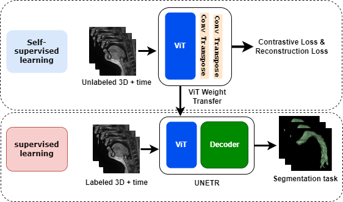

# 4D Upper Airway Segmentation

## Summary
The 4D Upper Airway Segmentation project aims to segment the 3D plus time upper airway speech sequences from multiple subjects. In this study, subjects pronounce vowels such as "a", "e", "i", "o", and "u". To achieve accurate segmentation, we utilize a UNet-based Vision Transformer models with self supervised training. For the SSL pre-training with proxy task, we have used the French speaker dataset. After pre-trianing the network is re-trained with data collected from university of iowa research MRI scanner.

## Table of Contents
- [Installation](#installation)
- [Usage](#usage)
- [Dataset](#dataset)
- [Model Architecture](#model-architecture)
- [Results](#results)
- [Citations](#contributions)

## Installation
To get started with this project, clone the repository and install the required dependencies.

```bash
git clone https://github.com/yourusername/4D-Upper-Airway-Segmentation.git
cd 4D-Upper-Airway-Segmentation
pip install -r requirements.txt
```
## Usage

To run the training and segmentation code directly from the Python files, follow the instructions below. The Python scripts are configured to allow easy modification of hyperparameters through command line arguments.

### Running the Training

Navigate to the project directory and execute the training script with your desired hyperparameters. For example:

```bash
python train.py --learning_rate 0.001 --batch_size 16 --epochs 50
```
### Datasets

The datasets used for this project are provided in the figshare folder. The Dataset utilized for pre-training (Upstream task - French speaker dataset) can be found at the following link:
- [French speaker dataset research article](https://www.ncbi.nlm.nih.gov/pmc/articles/PMC8486854/)
- [Dataset download link](https://springernature.figshare.com/ndownloader/files/28531989)

Additionally, the dataset collected from the University of Iowa research MRI scanner, which is used for fine-tuning the model, will be made available upon request or can be obtained through institutional access. Please click here for making a request:
- [Request for Downstream dataset](mailto:lingala.uiowa.edu)

## Model Architecture

Given below figure represents the model architecture used for this project. The pre-training is done by doing proxy tasks with the French speaker dataset, and the downstream task will be to segment the airway from the newly collected data.

The architecture is based on a UNet combined with a Vision Transformer (ViT) backbone. This hybrid architecture leverages the strengths of both UNet for spatial features extraction and ViT for capturing long-range dependencies in the data.



The model consists of:

1. **Encoder**: The encoder uses a Vision Transformer to capture context and relationships within the input sequences efficiently.
2. **Bottleneck**: A UNet-style bottleneck that combines the features extracted from the encoder before passing them to the decoder.
3. **Decoder**: The decoder reconstructs the segmentation maps from the features, utilizing skip connections from the encoder to maintain spatial resolution.
4. **Output Layer**: A final convolutional layer outputs the segmentation mask, indicating the segmented regions of the upper airway.

This architecture facilitates both high-level feature extraction and enabling precise segmentation of the upper airway over the 4D temporal data.

## Results

Given below are the project results containing both images and the table. Please refer to our paper for more detailed results.

## Citations

Please cite the following papers if you are using our code or dataset for development:

   [Automatic Multiple Articulator Segmentation in Dynamic Speech MRI Using a Protocol Adaptive Stacked Transfer Learning U-NET Model](https://www.mdpi.com/2306-5354/10/5/623)
 
   [Airway segmentation in speech MRI using the U-net architecture](https://ieeexplore.ieee.org/abstract/document/9098536)

   [Multimodal dataset of real-time 2D and static 3D MRI of healthy French speakers](https://www.nature.com/articles/s41597-021-01041-3)


